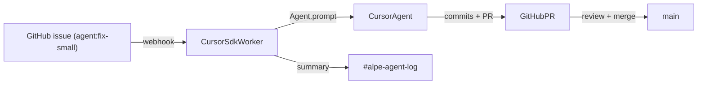

# ALPE Games — Automation roadmap (Phase 1.5+)

Phase 1 keeps automation low-risk: Slack notifies, humans launch Cursor in the IDE. This roadmap shows how to grow into Cursor SDK and Slack-driven workflows once the team is comfortable with the cycle.

Do not start any of this until at least one full cycle has shipped using the Phase 1 workflow.

## Phase 1 (now) — recap

- Slack: GitHub app, bug form, sprint reminders, deploy notifications.
- GitHub: issue templates, PR template, branch rules.
- Cursor: scoped tasks launched from IDE, agents stay on their own branch.

## Phase 1.5 — Cursor SDK as a teammate

Goal: turn `agent:*` labels on GitHub issues into Cursor SDK runs that open PRs and post results to Slack.

### Architecture



### Components

1. **`alpe-studio-tools` repo** (new) — small Node + TypeScript project.
   - Uses `@cursor/sdk` (see `cursor-skill: sdk` for invocation patterns).
   - Receives GitHub webhooks (issue labelled with `agent:*`) on a small HTTPS endpoint hosted on the same VPS.
   - For each event runs `Agent.prompt(...)` with a prompt template per label.
   - Logs run IDs and PR URLs to `#alpe-agent-log` via webhook.

2. **GitHub Action** (alternative if you prefer no webhook server) — runs the SDK on labeled issues. Pros: no server. Cons: SDK key sits in Actions secrets and runs use your CI minutes.

3. **Cursor SDK runtime choice**
   - **Local on VPS**: small, fast, requires checked-out repos on the VPS.
   - **Cloud** (`cloud: { repos }` + `autoCreatePR: true`): bigger isolation, auto-opens PRs, but consumes Cursor cloud credits.
   - Start with cloud — fewer moving parts.

### Label semantics

| Label | Prompt focus | Output |
|-------|--------------|--------|
| `agent:investigate` | Read-only root-cause analysis | Comment on the issue with findings; no code changes |
| `agent:fix-small` | Implement the fix described in the issue | New branch + PR |
| `agent:test` | Add a Playwright smoke test for the issue | New branch + PR touching `tests/` only |
| `agent:catalog` | Add a registry entry for a shipped game | PR on `alpe-games-site` |

Each prompt template lives in `alpe-studio-tools/prompts/*.md` and is rendered with the issue title, body, and repo context.

### Guardrails

- Cloud runs use `skipReviewerRequest: true` and `autoCreatePR: true`.
- The PR template (already in place) requires the "Agent disclosure" checkbox.
- No agent merges its own PR. A human reviews every PR before merge.
- `agent:investigate` is the only label that allows the agent to touch nothing — it must only comment.

### Failure handling

- `CursorAgentError` thrown — startup failure. Worker re-queues if `error.isRetryable`, otherwise posts a red message in `#alpe-agent-log` with the run ID.
- `result.status === "error"` — agent failed mid-run. Worker posts a yellow message linking the run dashboard URL.
- Cap concurrent runs per repo at 1 to enforce branch ownership.

## Phase 2 — Slack-triggered agents

Goal: simple slash commands so playtesters and the team can request automation from Slack.

```
/alpe-agent investigate <issue-url>
/alpe-agent fix <issue-url>
/alpe-agent summarize-pr <pr-url>
/alpe-agent draft-postmortem <slug>
```

Implementation:

- Slack app with slash commands posting to the same `alpe-studio-tools` endpoint.
- Slash commands create or label GitHub issues, then defer to the Phase 1.5 pipeline.
- Never let a slash command modify `main` or production directly.

## Phase 3 — Multi-agent orchestration (optional)

Only attempt this when:

- Two cycles have shipped using Phase 1.5 cleanly.
- The team has felt branch-ownership conflicts at least once.

Possible patterns:

- A "tester" agent runs Playwright after each PR and comments results.
- A "size-budget" agent fails PRs whose `dist/` exceeds the cycle's budget.
- A "release-notes" agent drafts the postmortem markdown on day 13 from issue history.

Each is an independent worker on a separate branch — never sharing branches.

## Implementation order (when you start Phase 1.5)

1. Create `alpe-studio-tools` repo (TypeScript, `@cursor/sdk`).
2. Implement a single command-line script: `pnpm run agent:fix-small <issue-url>`.
3. Wire one prompt template (`agent:fix-small`) and confirm it produces a clean PR end-to-end.
4. Add the GitHub webhook server only after step 3 works locally.
5. Add the rest of the labels.
6. Add Slack slash commands.

This order keeps the riskiest piece (autonomous PRs) behind a manual trigger you can stop.

## Open questions to revisit

- Cursor SDK runtime: local on VPS vs cloud — depends on Cursor pricing at the time.
- Whether to migrate repos to a GitHub organization. Personal account works; an org makes shared secrets and webhooks cleaner.
- Whether to add Playwright smoke tests in every game repo or only the template.
