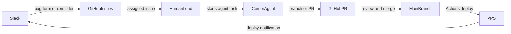

# ALPE Games — Team Workflow (Phase 1)

This document defines how the two-person team operates a 10–15 day game cycle using GitHub, Slack, and Cursor. It is the source of truth for **who owns what** and **where work lives**.

## Principles

1. **GitHub is the source of truth.** Branches, issues, PRs, and Actions decide what ships.
2. **Slack is the notification and intake layer.** Bugs, reminders, deploys, and agent summaries land here. Work state is not stored in Slack.
3. **Cursor is the implementation layer.** Agents work on scoped issues against branches, never on `main`.
4. **One human is the merge owner per day.** Avoids merge conflicts and scope drift.

## Roles (rotate each cycle)

| Role | Owns |
|------|------|
| **Game lead** | Core mechanic, branch coordination, final merges, Cursor scope decisions |
| **Support lead** | Polish, playtesting, bug triage, screenshots, postmortem, catalog registry PR |

Both members can use Cursor. **Only the game lead merges to `main`** during their cycle.

## Branch model (per game repo)

| Branch | Purpose | Owner |
|--------|---------|-------|
| `main` | Always deployable | Game lead (merges only) |
| `game/core-mechanic` | Main playable loop | Game lead |
| `game/polish-pass` | Juice, audio, UI | Support lead |
| `fix/<short-bug>` | Single bug fix | Either |
| `agent/<issue-number>-<slug>` | Cursor agent work | Whoever launched the agent |

Rules:

- One branch has one human or one agent at a time — never both.
- Agents never push to `main`.
- One issue per agent task; agents do not pick up "make game better".
- PRs must be reviewable in under 10 minutes.
- Build must pass before merge.

## Multi-agent rules

| Pattern | Allowed |
|---------|---------|
| One implementation agent per issue, on its own branch | Yes |
| One read-only reviewer agent on a PR | Yes |
| One debug agent investigating a bug (no commits) | Yes |
| Two agents editing the same file on the same branch | No |
| Agent doing broad refactors mid-cycle | No |
| Agent pushing to `main` | No |

When in doubt: **one branch, one owner, one issue.**

## Slack channels

| Channel | Purpose |
|---------|---------|
| `#alpe-game-lab` | Daily coordination, theme, scope cuts |
| `#alpe-builds` | GitHub Actions, deploy URLs, workflow failures |
| `#alpe-bugs` | Playtest bug reports |
| `#alpe-agent-log` | Cursor agent summaries, PR links, automation messages |

Setup steps live in [SLACK.md](SLACK.md).

## GitHub conventions (every game repo)

- **Issue templates:** Bug Report and Game Task (added to `alpe-phaser-game-template`).
- **PR template:** scope and build checklist.
- **Labels:** `bug`, `polish`, `scope-cut`, `agent:investigate`, `agent:fix-small`, `agent:test`, `agent:catalog`.

`agent:*` labels are reserved for Phase 1.5 automation. In Phase 1 they document intent.

## Day-by-day workflow

| Day | Focus | What to do |
|-----|-------|------------|
| 0 | Scope lock | Create repo from template, write README scope, create 3–6 issues, post pitch in `#alpe-game-lab` |
| 1–4 | Playable loop | Game lead owns core branch; one issue at a time |
| 5–8 | Content + polish | Separate branches for polish/fix; narrow agent tasks only |
| 9 | Ruthless cut | Freeze features; convert feedback into critical issues only |
| 10–12 | Stabilize | Bug fixes only; deploy frequently |
| 13–15 | Ship | Deploy → catalog PR → postmortem → release post |

Ship checklist lives in [CYCLE-1.md](CYCLE-1.md).

## Cursor usage rules

When starting a Cursor task in a game repo:

1. Reference a **GitHub issue number** in the prompt.
2. Confirm the **branch** before edits begin.
3. Keep the change under ~300 lines unless scaffolding.
4. Run `npm run build` locally before opening a PR.
5. Post the PR link in `#alpe-agent-log` with a one-line summary.

Use `Agent.prompt(...)` (one-shot) for bounded tasks. Use `Agent.create(...)` only when iterating in the same session.

## Phase boundaries

| Phase | In scope | Deferred to next |
|-------|----------|------------------|
| **1 (now)** | GitHub for Slack, Slack bug form, scheduled reminders, deploy notifications, issue/PR templates, branch rules | Cursor SDK Slack bot, autonomous PRs |
| **1.5** | Cursor SDK one-shots triggered by `agent:*` labels, agent log to Slack | Multi-agent orchestration |
| **2** | Slack slash commands, dashboards, analytics | — |

The Phase 1.5 roadmap lives in [AUTOMATION-ROADMAP.md](AUTOMATION-ROADMAP.md).
